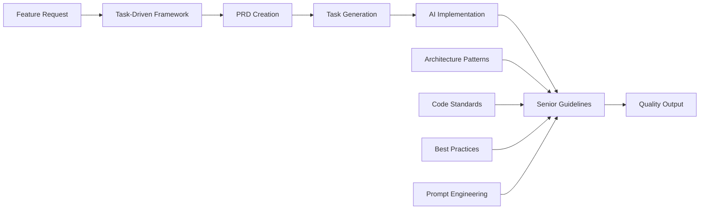

# 🔮 The Future of Coding

## 📋 Resumen

**The Future of Coding** es un framework integral que revoluciona cómo los desarrolladores trabajan con AI. En lugar del caótico "vibe coding," proporcionamos metodologías estructuradas que elevan a cualquier desarrollador para producir código de nivel senior con asistencia de AI.

## 💡 La Motivación

### **¿Por qué ahora?**

Hemos llegado a un punto de inflexión en la industria del software. Durante décadas, la barrera para escribir código de calidad era el conocimiento y la experiencia. **La AI ha eliminado esa barrera... pero ha creado una nueva: la metodología.**

Hoy vemos equipos completos usando AI de forma caótica:
- 🔥 **"Accept All" culture**: Desarrolladores que aprueban cambios sin entender qué hace el código
- 📦 **Black box development**: Features que funcionan pero nadie sabe cómo ni por qué
- 🏗️ **Architecture debt**: Código generado que no sigue patrones consistentes
- 🎯 **Scope creep explosivo**: Projects que crecen sin control porque "la AI puede hacer cualquier cosa"

### **La Brecha que Necesitamos Llenar**

**Entre el poder de la AI y la realidad enterprise existe un abismo.**

Las herramientas actuales nos dan:
- ✅ Velocidad increíble para generar código
- ✅ Capacidad de implementar ideas complejas rápidamente
- ✅ Democratización del desarrollo

Pero **no nos dan**:
- ❌ Estructura para mantener calidad a escala
- ❌ Metodologías para review y aprobación
- ❌ Frameworks para knowledge transfer
- ❌ Patrones para consistencia arquitectónica

### **El Desafío del No-Determinismo**

Como observa [Martin Fowler](https://martinfowler.com/articles/2025-nature-abstraction.html), los LLMs introducen un desafío fundamental: *"When I wrote a Fortran function, I could compile it a hundred times, and the result still manifested the exact same bugs. Large Language Models introduce a non-deterministic abstraction, so I can't just store my prompts in git and know that I'll get the same behavior each time."*

**¿Por qué los LLMs no son predecibles?** Su naturaleza probabilística significa que procesan el mismo input através de redes neuronales que introducen variabilidad inherente. Cada ejecución puede activar diferentes patrones, generar distintas interpretaciones, y producir soluciones válidas pero diferentes.

**Este es el reto central**: necesitamos metodologías que nos permitan **acercarnos a la predictibilidad** trabajando con herramientas cuyo output naturalmente varía, manteniendo al mismo tiempo el control y la consistencia que requieren los proyectos enterprise.

### **Nuestra Convicción**

**Creemos que la AI debería amplificar la inteligencia humana, no reemplazarla.**

El futuro no es developers que no entienden su código. El futuro son developers que:
- 🧠 **Piensan a nivel arquitectónico** mientras la AI maneja la implementación
- 🎯 **Mantienen control granular** sobre cada decisión importante
- 📚 **Aprenden patrones senior** través de AI bien estructurada
- 🚀 **Escalan su impacto** sin sacrificar calidad

**Este framework existe porque creemos que podemos tener velocidad, calidad, productividad, comprensión, innovación y control.**

No tenemos que elegir entre ser 10x más rápidos o ser buenos developers. Podemos ser ambos.

### **🔄 La Evolución que Perseguimos**

**Estamos evolucionando hacia AI Assisted Engineering - donde la AI amplifica las capacidades humanas sin reemplazar el criterio ingenieril.**

Esta evolución representa tres fases clave:

1. **🔧 Traditional Engineering**: Desarrollo manual con herramientas básicas
2. **🤖 AI-Powered Coding**: AI genera código, pero con control humano limitado
3. **⚡ AI Assisted Engineering**: **Simbiosis perfecta donde engineers orquestan AI agents para maximizar tanto velocidad como calidad**

En **AI Assisted Engineering**:
- 🎯 **Engineers diseñan y planifican** (arquitectura, PRDs, decisiones técnicas)
- 🤖 **AI agents implementan** (código, tests, documentación)
- 🔍 **Engineers supervisan y aprueban** (revisiones granulares, control de calidad)
- 📈 **Ambos aprenden y mejoran** (patrones emergentes, optimización continua)

**El resultado: Engineering teams que operan a velocidad de AI con calidad de senior engineer.**

## 🏗️ Arquitectura de Dos Pilares

### 📋 **Pilar 1: Task-Driven Development Framework**

Un enfoque estructurado para el desarrollo asistido por AI que reemplaza el caótico "vibe coding" con procesos controlados y revisables.

**Componentes Principales:**
- **Product Requirements Documents (PRD)** como base de planificación
- **Task lists granulares** derivadas de PRDs
- **Integración con flujos de trabajo** usando branches de planning y development
- **AI assistants** como herramientas de implementación controlada
- **Procesos de revisión multinivel** para aseguramiento de calidad

**Beneficios Clave:**
- ✅ **Control sobre AI**: Aprobación task-by-task en lugar de "Accept All"
- ✅ **Resultados predecibles**: Planificación estructurada previene scope creep
- ✅ **Enterprise-ready**: Procesos auditables y documentación clara
- ✅ **Escalabilidad de equipo**: Workflows consistentes entre desarrolladores

### 🎯 **Pilar 2: Senior-Level Code Generation Guidelines**

Lineamientos integrales que transforman a cualquier desarrollador en un generador de código de nivel senior usando asistencia de AI.

**Componentes Principales:**
- **Architecture Patterns**: Patrones de diseño y principios probados en batalla
- **Code Style Standards**: Código consistente y mantenible entre equipos
- **Best Practices Library**: Prácticas curadas para escenarios comunes
- **AI Prompt Engineering**: Cómo obtener output de nivel senior de herramientas AI
- **Quality Gates**: Verificaciones automáticas y manuales para excelencia de código

**Beneficios Clave:**
- 🧠 **Seniority Instantánea**: Desarrolladores junior y mid producen código de calidad senior
- 🏗️ **Consistencia Arquitectónica**: Patrones estandarizados entre proyectos
- 📚 **Transferencia de Conocimiento**: Mejores prácticas embebidas en workflows
- ⚡ **Aprendizaje Acelerado**: Aprende mientras construyes con guía de AI

## 🎯 Cómo Funciona

### **El Workflow Completo:**

1. **📝 Estructura**: Usa Task-Driven Development para planificación organizada
2. **🤖 Genera**: Aplica Senior Guidelines para implementación asistida por AI
3. **✅ Revisa**: Verificaciones de calidad multinivel aseguran excelencia
4. **🚀 Despliega**: Código production-ready que sigue estándares enterprise

## 🎯 Audiencia Objetivo

### **👨‍💼 Para Líderes de Ingeniería**
- Estandarizar la adopción de AI en equipos
- Asegurar calidad y consistencia del código
- Acelerar la productividad de desarrolladores junior
- Implementar workflows enterprise-ready

### **👩‍💻 Para Desarrolladores**
- Aprender patrones de nivel senior a través de asistencia AI
- Seguir procesos de desarrollo estructurados
- Producir código de mayor calidad más rápido
- Construir confianza en desarrollo asistido por AI

### **🏢 Para Organizaciones**
- Escalar capacidades de desarrollo eficientemente
- Mantener estándares de calidad del código
- Reducir deuda técnica e inconsistencias
- Asegurar el futuro de las prácticas de desarrollo

## 🎯 Principios Fundamentales

### **Control, No Automatización Ciega**
- Cada decisión importante requiere aprobación humana
- Tasks granulares permiten revisión incremental
- AI implementa, humans supervisan y aprueban

### **Estructura, No Caos**
- PRDs definen scope y objetivos claramente
- Task lists proporcionan roadmap detallado
- Procesos auditables y documentación viva

### **Aprendizaje, No Dependencia**
- Developers aprenden patrones senior a través de AI
- Knowledge transfer embebido en el proceso
- Capacidades humanas amplificadas, no reemplazadas

---

*El futuro del coding no es escribirlo, sino orquestar agentes de AI que lo hagan de manera estructurada y controlada*
