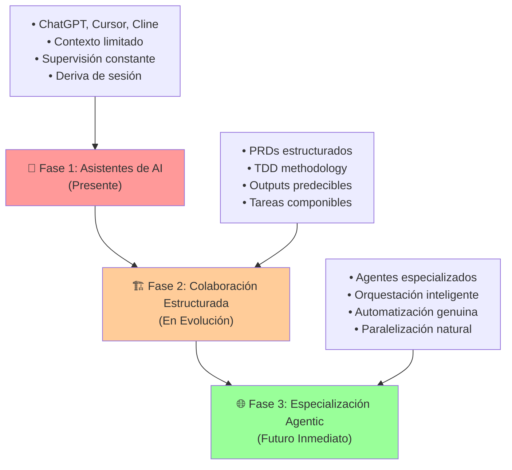
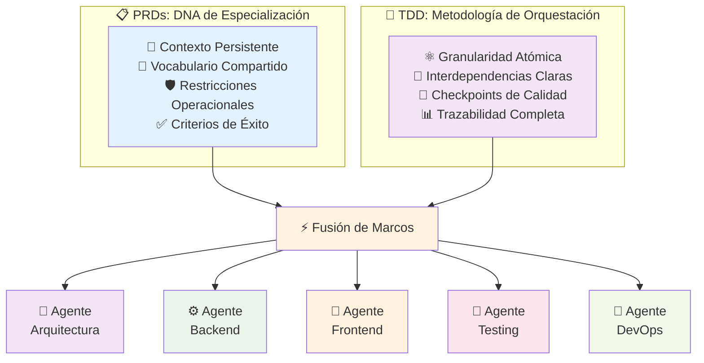
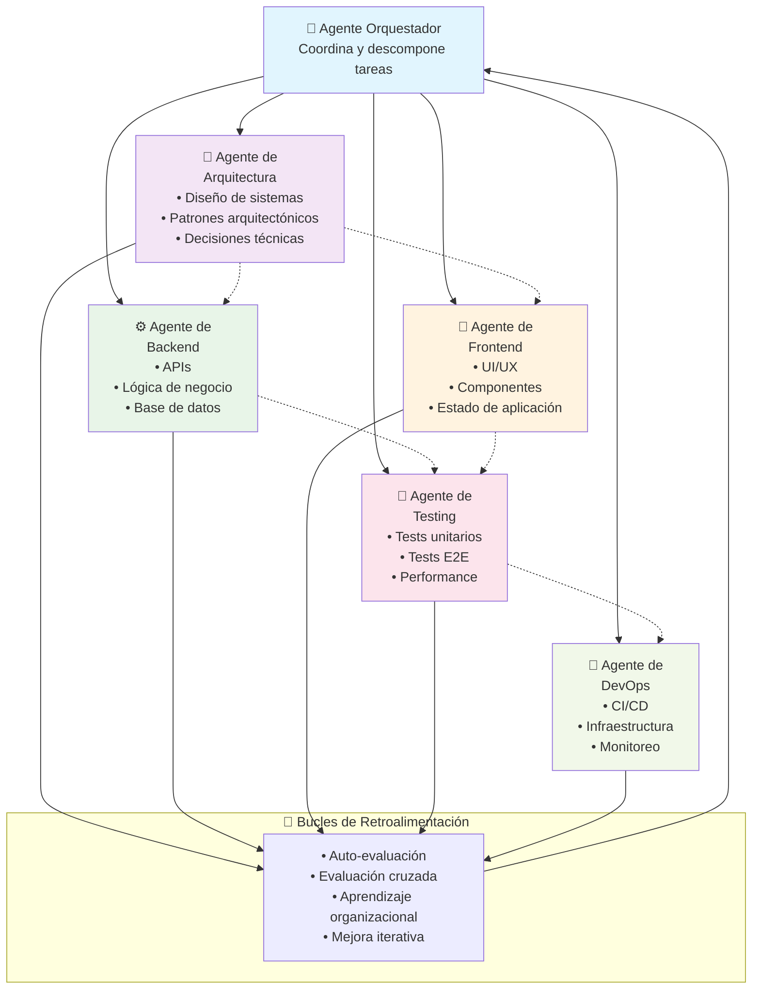
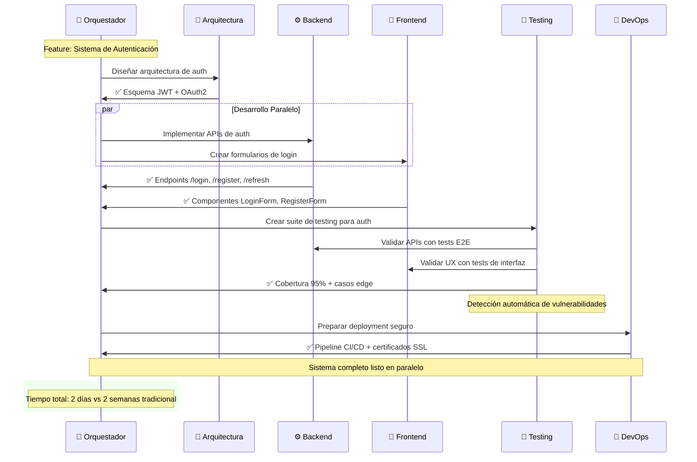
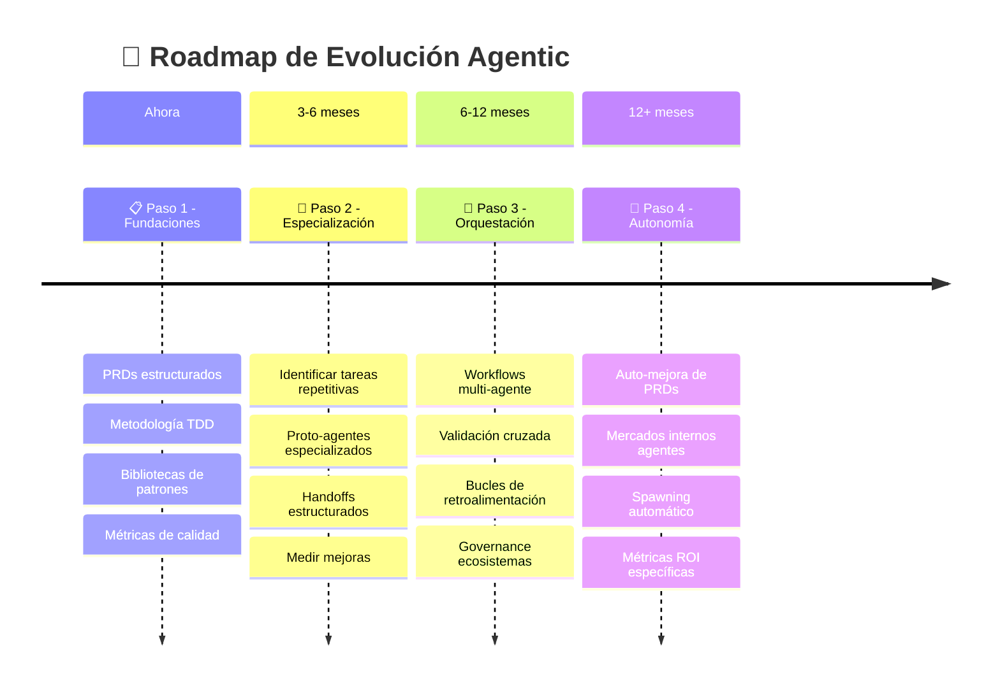

# 🤖 Evolución Agentic: De PRDs a Agentes Especializados

## 📋 Visión Ejecutiva

**Estamos en el umbral de la Revolución Agentic.** Los Documentos de Requerimientos de Prompts (PRDs) y el Desarrollo Dirigido por Tareas (TDD) no son destinos finales - son **fundaciones críticas** para el siguiente salto evolutivo: **sistemas de desarrollo compuestos por agentes especializados** que automatizan incrementalmente las tareas más repetitivas y bien definidas del desarrollo de software.

**El futuro no es un asistente monolítico de AI que hace todo.** Es un ecosistema de agentes especializados que colaboran bajo marcos estructurados para entregar software con velocidad y calidad sin precedentes.

## 🎯 La Trayectoria Evolutiva: De Asistentes a Ecosistemas

### **Fase 1: Asistentes de AI (Presente)**
- **Estado Actual**: Herramientas como ChatGPT, Cursor, Cline proporcionan asistencia conversacional
- **Limitaciones**: Contexto limitado, deriva de sesión, necesidad de supervisión humana constante
- **Solución**: PRDs estructurados que mantienen coherencia y direccionalidad

### **Fase 2: Colaboración Estructurada (En Evolución)**
- **Emergente**: Frameworks como TDD que descomponen problemas complejos en tareas específicas
- **Beneficio**: Cada tarea tiene contexto claro, criterios de éxito definidos, y límites bien establecidos
- **Resultado**: Outputs más predecibles y componibles entre sesiones

### **Fase 3: Especialización Agentic (Futuro Inmediato)**
- **Visión**: Agentes especializados que dominan dominios específicos del desarrollo
- **Arquitectura**: Múltiples agentes trabajando en paralelo bajo orquestación inteligente
- **Impacto**: Automatización genuina de patrones de desarrollo bien comprendidos

## 🏗️ Cómo PRDs y TDD Habilitan la Evolución Agentic

### **PRDs: El DNA de la Especialización**
Los Documentos de Requerimientos de Prompts proporcionan la **especificación comportamental** que permite crear agentes especializados:

- **Contexto Persistente**: Define el dominio de conocimiento específico del agente
- **Vocabulario Compartido**: Establece el lenguaje técnico que el agente debe dominar
- **Restricciones Operacionales**: Delimita qué puede y no puede hacer el agente
- **Criterios de Éxito**: Define cómo el agente puede auto-evaluar su performance

**Ejemplo**: Un PRD de "Agente de Testing" especifica patrones de testing, frameworks preferenciales, criterios de cobertura, y estándares de calidad. Este PRD se convierte en la especialización del agente.

### **TDD: La Metodología de Orquestación**
El Desarrollo Dirigido por Tareas proporciona la **metodología de descomposición** que permite que múltiples agentes colaboren efectivamente:

- **Granularidad Atómica**: Cada tarea es lo suficientemente específica para ser manejada por un agente especializado
- **Interdependencias Claras**: Define qué agentes necesitan colaborar y en qué secuencia
- **Checkpoints de Calidad**: Establece puntos de validación entre transferencias de agentes
- **Trazabilidad Completa**: Mantiene audit trail de qué agente hizo qué contribución

**Ejemplo**: Una feature de autenticación se descompone en tareas para agentes especializados en backend, frontend, testing, seguridad, y documentación.

## 🎯 Los Pilares de la Arquitectura Agentic

### **1. 🧠 Agentes Especializados por Dominio**

**Agente de Arquitectura**
- **Especialización**: Diseño de sistemas, patrones arquitectónicos, decisiones de tecnología
- **Input**: Requerimientos de negocio, restricciones técnicas, objetivos de performance
- **Output**: Diagramas de arquitectura, decisiones técnicas documentadas, guías de implementación

**Agente de Backend**
- **Especialización**: APIs, lógica de negocio, integración de bases de datos, microservicios
- **Input**: Especificaciones de endpoints, modelos de datos, reglas de negocio
- **Output**: Código de servidor, esquemas de BD, documentación de APIs

**Agente de Frontend** 
- **Especialización**: Interfaces de usuario, experiencia de usuario, responsividad, accesibilidad
- **Input**: Mockups, especificaciones de UI/UX, requerimientos de accesibilidad
- **Output**: Componentes de UI, lógica de estado, styling, tests de interfaz

**Agente de Testing**
- **Especialización**: Testing unitario, testing de integración, testing end-to-end, performance
- **Input**: Código implementado, criterios de aceptación, escenarios de uso
- **Output**: Suites de testing comprehensivas, reportes de cobertura, benchmarks de performance

**Agente de DevOps**
- **Especialización**: CI/CD, containerización, infraestructura como código, monitoreo
- **Input**: Aplicaciones desarrolladas, requerimientos de deployment, políticas de seguridad  
- **Output**: Pipelines automatizados, configuraciones de infraestructura, dashboards de monitoreo

### **2. 🎼 Orquestación Inteligente**
Un **Agente Orquestador** que:
- Analiza tareas complejas y las descompone para agentes especializados
- Maneja dependencias y secuenciación entre agentes
- Detecta y resuelve conflictos entre outputs de diferentes agentes
- Mantiene coherencia arquitectónica a través de todo el proyecto

### **3. 🔄 Bucles de Retroalimentación Continuos**
- **Auto-evaluación**: Cada agente evalúa la calidad de su propio output
- **Evaluación cruzada**: Agentes relacionados revisan y validan el trabajo de otros
- **Aprendizaje organizacional**: Patrones exitosos se codifican para uso futuro
- **Mejora iterativa**: Performance y calidad mejoran con cada iteración

## ⚡ Las Ventajas del Desarrollo Agentic

### **Especialización Profunda**
- Cada agente desarrolla expertise genuino en su dominio específico
- Conocimiento especializado se acumula y mejora continuamente
- Errores de dominio específico disminuyen dramáticamente
- Mejores prácticas se cristalizan en comportamientos automatizados

### **Paralelización Natural**
- Múltiples agentes pueden trabajar simultáneamente en diferentes aspectos
- Ciclos de desarrollo se comprimen desde semanas a días
- Dependencias críticas se identifican y resuelven temprano
- Bottlenecks humanos se eliminan en tareas bien definidas

### **Escalabilidad Sin Límites**
- Nuevos agentes especializados se pueden agregar para nuevos dominios
- Complejidad no crece linealmente con el tamaño del proyecto
- Conocimiento organizacional se preserva independientemente de rotación de personal
- Best practices se propagan automáticamente entre proyectos

### **Calidad Consistente**
- Estándares de calidad se aplican uniformemente por agentes especializados
- Variabilidad humana se reduce en tareas susceptibles a automatización
- Code reviews se enfocan en decisiones arquitectónicas de alto nivel
- Testing comprehensive se genera automáticamente

## 🌟 Casos de Uso Emergentes: Automatización Incremental

### **Ejemplo Práctico: Sistema de Autenticación**

### **Automatización de Testing (Corto Plazo)**
- **Estado Actual**: Desarrolladores escriben tests manualmente con asistencia de AI
- **Evolución Agentic**: Agente especializado genera suites completas de testing basándose en código implementado
- **Beneficio**: Cobertura de testing del 95%+ automática, detección temprana de edge cases

### **Generación de APIs (Mediano Plazo)**  
- **Estado Actual**: Desarrolladores diseñan e implementan endpoints API manualmente
- **Evolución Agentic**: Agente de Backend genera APIs completas desde especificaciones de negocio
- **Beneficio**: APIs consistentes, documentación automática, validación de contratos

### **Optimización de Performance (Mediano Plazo)**
- **Estado Actual**: Optimizaciones de performance requieren expertise especializado  
- **Evolución Agentic**: Agente de Performance analiza continuamente y optimiza automáticamente
- **Beneficio**: Performance óptimo mantenido automáticamente, identificación proactiva de bottlenecks

### **Deployment y Operaciones (Largo Plazo)**
- **Estado Actual**: DevOps requiere configuración manual compleja y monitoreo constante
- **Evolución Agentic**: Agente de DevOps maneja deployment, scaling, y healing automáticamente  
- **Beneficio**: Operaciones 24/7 sin intervención humana, auto-scaling inteligente

## 🔮 La Visión: Desarrollo Como Diseño

En la era agentic madura, el desarrollo de software evoluciona hacia **desarrollo como diseño**:

- **Humanos se enfocan en**: Visión del producto, arquitectura de alto nivel, decisiones de negocio
- **Agentes manejan**: Implementación detallada, testing, deployment, operaciones
- **Colaboración**: Humanos diseñan la intención, agentes ejecutan la implementación
- **Resultado**: Velocidad de pensamiento a código, calidad enterprise por defecto

### **El Nuevo Rol del Desarrollador**
Los desarrolladores evolucionan hacia **Arquitectos de Sistemas Agentics**:
- Diseñan la colaboración entre agentes especializados
- Definen los PRDs que guían el comportamiento agentic
- Supervisan la calidad de la orquestación entre agentes
- Iteran en la mejora continua del ecosistema agentic

## 🚀 El Camino Hacia la Evolución Agentic

### **Paso 1: Dominar PRDs y TDD (Ahora)**
- Implementar Documentos de Requerimientos de Prompts estructurados
- Adoptar metodología de Desarrollo Dirigido por Tareas
- Crear bibliotecas de patrones reutilizables
- Establecer métricas de calidad para output de AI

### **Paso 2: Experimentar con Especialización (3-6 meses)**
- Identificar tareas altamente repetitivas y bien definidas en tu workflow
- Crear "proto-agentes" especializados usando PRDs específicos de dominio
- Implementar handoffs estructurados entre diferentes especialidades
- Medir mejoras en velocidad y calidad

### **Paso 3: Orquestación Básica (6-12 meses)**
- Desarrollar workflows que coordinen múltiples agentes especializados
- Implementar validación cruzada entre outputs de diferentes agentes
- Crear bucles de retroalimentación para mejora continua
- Establecer governance para ecosistemas multi-agente

### **Paso 4: Autonomía Agentic (12+ meses)**
- Implementar agentes que pueden auto-mejorar sus PRDs basándose en experiencia
- Crear mercados internos de agentes especializados
- Desarrollar capacidades de spawning automático de nuevos agentes según necesidad
- Establecer métricas de ROI para contribuciones agentic específicas

## 🎯 La Conclusión: El Imperativo Evolutivo

**La evolución hacia desarrollo agentic no es opcional - es inevitable.** Las organizaciones que construyan las fundaciones estructuradas hoy (PRDs + TDD) estarán posicionadas para liderar la transición hacia ecosistemas de agentes especializados.

Aquellas que permanezcan en enfoques ad-hoc de AI se encontrarán competiendo contra equipos que operan con ecosistemas completos de agentes especializados trabajando 24/7.

**Los PRDs y TDD no son herramientas - son los cimientos de la próxima revolución en desarrollo de software.**

La pregunta no es si la evolución agentic va a suceder, sino **¿estarás listo para liderarla cuando llegue?**

---

*El futuro del desarrollo es un ecosistema donde la inteligencia humana define la visión y la inteligencia artificial ejecuta la implementación - pero solo funciona con fundaciones estructuradas que permitan que ambas operen en armonía.* 