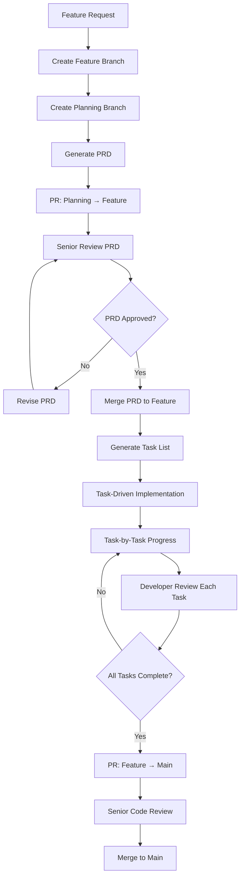
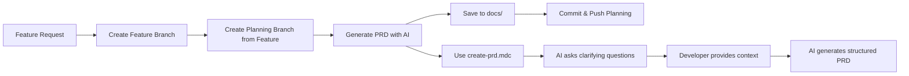
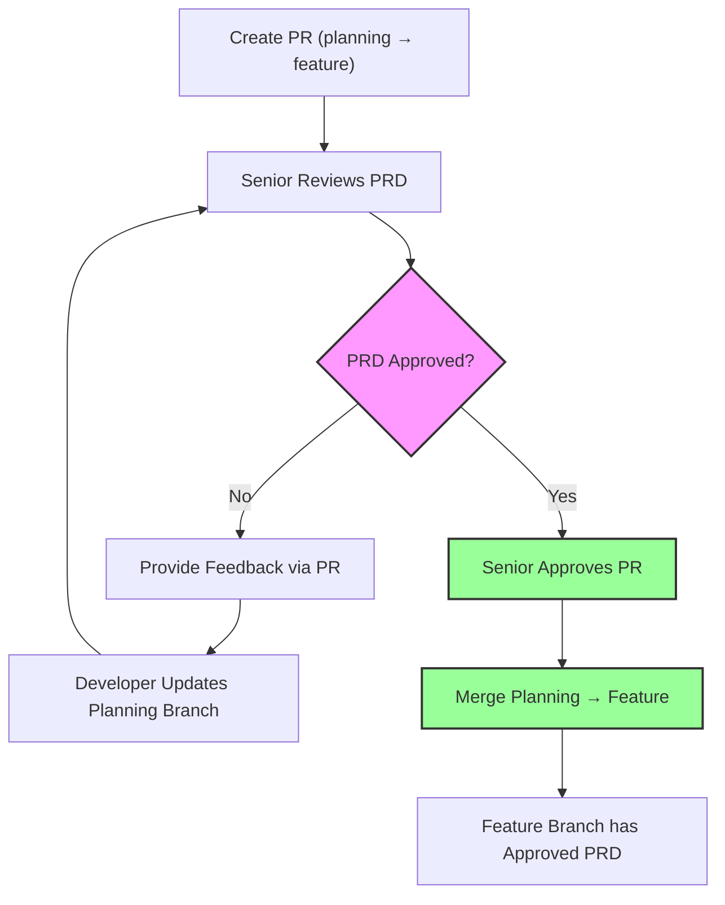
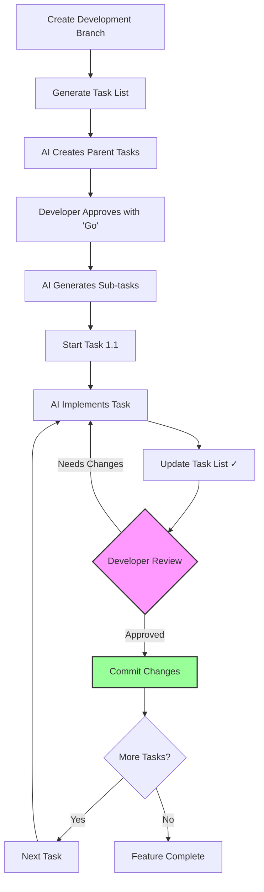
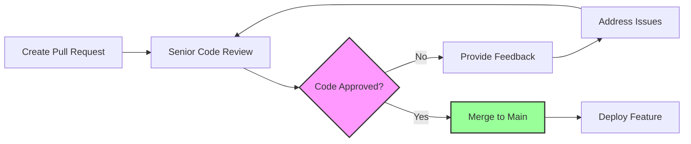
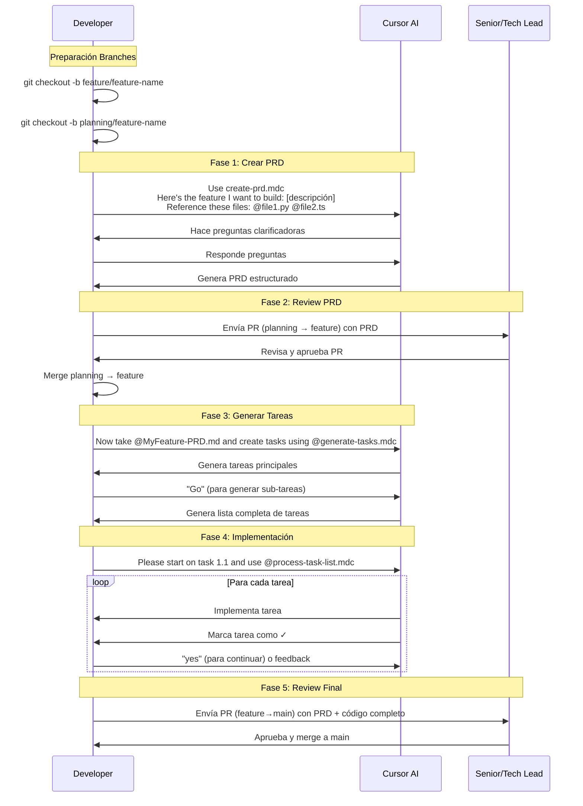

# 🚀 The Future of Coding: Task-Driven Development

## 📋 Resumen

Esta guía presenta un framework innovador de **Task-Driven Development** que transforma cómo los equipos desarrollan software de manera estructurada. Combina metodologías probadas de planificación (PRD) con Git Flow y herramientas de AI para crear un proceso escalable, controlado y auditable que maximiza la productividad mientras minimiza los riesgos.

**Objetivo**: Crear un desarrollo más eficiente y predecible, manteniendo calidad, control y transferencia de conocimiento en el equipo.

## 🎯 El Problema Actual: Más Allá del "Vibe Coding"

El auge de herramientas de AI ha popularizado el vibe coding - un enfoque donde los desarrolladores "fully give in to the vibes" y delegan completamente la escritura de código a LLMs sin revisión estructurada.

### **Los Riesgos del Vibe Coding Sin Estructura**

Como define **Simon Willison**: *"building software with an LLM without reviewing the code it writes"*, el vibe coding presenta riesgos significativos:

- **Pérdida de control**: *"I 'Accept All' always, I don't read the diffs anymore"* - Andrej Karpathy
- **Comprensión limitada**: *"The code grows beyond my usual comprehension"* 
- **Soluciones subóptimas**: *"Sometimes the LLMs can't fix a bug so I just work around it"*
- **Riesgo de producción**: No es production-ready sin revisión cuidadosa

### **Problemas Adicionales en Equipos**

- **Desarrollo no estructurado**: Features implementadas sin planificación clara
- **Falta de control**: Cambios grandes sin revisión adecuada 
- **Pérdida de contexto**: Decisiones de diseño no documentadas
- **Inconsistencia**: Cada developer usa herramientas/AI diferente
- **Scope creep**: Features que crecen sin límites definidos

## 💡 La Solución: Task-Driven Development

**Task-Driven Development** mantiene los beneficios del AI-assisted coding mientras elimina los riesgos del vibe coding descontrolado. En lugar de "Accept All" sin revisión, implementamos **control granular** con **aprobación por tarea**.

### **Vibe Coding vs Task-Driven Development**

| Aspecto | Vibe Coding | Task-Driven Development |
|---------|-------------|------------------------|
| **Control** | *"Accept All always"* | ✅ Aprobación por tarea individual |
| **Comprensión** | *"Code grows beyond comprehension"* | ✅ Tasks granulares y documentadas |
| **Planificación** | Improvisado | ✅ PRD estructura objetivos claros |
| **Revisión** | Sin revisar diffs | ✅ Múltiples puntos de control |
| **Debugging** | *"Random changes until it goes away"* | ✅ Contexto claro por task |
| **Producción** | *"Not production ready"* | ✅ Listo para producción |

### **Componentes Clave**

1. **Product Requirements Document (PRD)** como base de planificación
2. **Task Lists granulares** derivadas del PRD para guiar implementación
3. **Git Flow adaptado** para branches de planificación y desarrollo
4. **AI Agents (Cursor)** como herramienta de implementación **controlada**
5. **Proceso de revisión** en múltiples niveles

## 🏗️ Arquitectura del Proceso



## 👥 Roles y Responsabilidades

### **Senior/Tech Lead** 
- Revisar y aprobar PRDs
- Validar arquitectura técnica
- Review final de código
- Mentoring en mejores prácticas

### **Developer/Feature Owner**
- Crear PRD inicial
- Generar task list
- Orquestar AI agent
- Implementar con guía de AI
- Documentar decisiones

### **AI Agent (Cursor)**
- Generar código basado en tareas
- Seguir patrones establecidos
- Implementar una tarea a la vez
- Esperar aprobación entre tareas

## 🔄 Proceso Detallado

### **Fase 1: Planificación**



```bash
# 1. Crear feature branch (inicialmente vacío)
git checkout -b feature/feature-name

# 2. Crear planning branch desde feature
git checkout -b planning/feature-name

# 3. Generar PRD usando AI
# En Cursor Chat:
```
Use create-prd.mdc
Here's the feature I want to build: [Describe your feature in detail]
Reference these files to help you: [Optional: @file1.py @file2.ts]
```

# 4. Commit del PRD
git add docs/
git commit -m "feat: add PRD for [feature-name]"
git push origin planning/feature-name
```

### **Fase 2: Revisión de Planificación**



**Proceso:**
- **PR**: `planning/feature-name` → `feature/feature-name`
- Senior review del PRD usando herramientas nativas de Git
- Feedback y refinamiento via comentarios de PR
- **Aprobación y Merge**: Senior aprueba y hace merge del PRD al feature branch
- Feature branch ahora contiene el PRD aprobado para desarrollo

### **Fase 3: Implementación Task-Driven**



```bash
# 1. Continuar desarrollo en feature branch (ya tiene PRD aprobado)
git checkout feature/feature-name  # Branch con PRD ya mergeado

# 2. Generar task list
# En Cursor Chat:
```
Now take @MyFeature-PRD.md and create tasks using @generate-tasks.mdc
```

# 3. Implementación iterativa
# En Cursor Chat:
```
Please start on task 1.1 and use @process-task-list.mdc
```
# Después de cada tarea: commits frecuentes y aprobación del usuario

# 4. Al final: PR que incluye PRD + código implementado
git push origin feature/feature-name
# Crear PR: feature/feature-name → main (incluye docs/ y código completo)
```

### **Fase 4: Revisión e Integración**



**Proceso:**
- Pull Request de feature branch
- Code review por Senior
- Merge a main después de aprobación

## 💬 Comandos de Cursor - Workflow Completo



### 📋 Comandos Práticos para Copy-Paste

**0. Setup de Branches:**
```bash
git checkout -b feature/feature-name
git checkout -b planning/feature-name
```

**1. Crear PRD:**
```
Use create-prd.mdc
Here's the feature I want to build: [Describe your feature in detail]
Reference these files to help you: [Optional: @file1.py @file2.ts]
```

**2. Después del PR Review (planning → feature):**
```bash
git checkout feature/feature-name
git merge planning/feature-name
```

**3. Generar Tareas:**
```
Now take @MyFeature-PRD.md and create tasks using @generate-tasks.mdc
```

**4. Iniciar Implementación:**
```
Please start on task 1.1 and use @process-task-list.mdc
```

## 📁 Estructura de Directorios

```
project/
├── docs/
│   ├── prd-feature-1.md
│   ├── prd-feature-2.md
│   └── ai-development-guide.md
├── tasks/
│   ├── tasks-feature-1.md
│   ├── tasks-feature-2.md
│   └── completed/
└── .cursor/
    └── rules/
        ├── create-prd.mdc
        ├── generate-tasks.mdc
        └── process-task-list.mdc
```

## 🎯 Beneficios Esperados

### **Para el Negocio**
- ⚡ **Velocidad**: Aceleración significativa en el desarrollo
- 📊 **Predictibilidad**: Mejor estimación y seguimiento
- 🔍 **Trazabilidad**: Decisiones documentadas y auditables
- 💰 **ROI**: Mejor relación costo-beneficio en desarrollo

### **Para el Equipo**
- 🧠 **Aprendizaje**: Seniors mentorean, juniors aprenden
- 🎯 **Foco**: Desarrolladores se enfocan en lógica y arquitectura, no en sintaxis
- 📈 **Crecimiento**: Exposición a mejores prácticas via tasks estructuradas y AI
- 🤝 **Colaboración**: Proceso claro y compartido

### **Para la Calidad**
- ✅ **Testing**: Tests generados automáticamente por task
- 📝 **Documentación**: PRDs y tasks como documentación viva
- 🔒 **Consistencia**: Patrones uniformes via tasks estructuradas
- 🛡️ **Revisión**: Múltiples puntos de control por task
- 🎯 **Scope Control**: Tasks granulares previenen scope creep

## 📊 Métricas de Éxito

### **Métricas de Velocidad**
- Throughput de features implementadas
- Número de tareas completadas por sprint
- Eficiencia en procesos de review

### **Métricas de Calidad**
- Bugs en producción post-implementación
- Cobertura de tests automáticos
- Velocidad de resolución de incidencias

### **Métricas de Adopción**
- Porcentaje de features usando el proceso
- Satisfacción del equipo (surveys)
- Eficiencia en onboarding de nuevos developers

## 🚀 Plan de Implementación

### **Fase 1: Preparación**
- [ ] Setup de herramientas (.mdc files en `.cursor/rules/`)
- [ ] Configuración de estructura de directorios (`docs/`, `tasks/`)
- [ ] Capacitación del equipo en Cursor
- [ ] Definición de templates y estándares

### **Fase 2: Piloto**
- [ ] Seleccionar 1-2 features pequeñas
- [ ] Implementar con el proceso completo
- [ ] Recopilar feedback y ajustar

### **Fase 3: Expansión**
- [ ] Aplicar a features medianas
- [ ] Refinar proceso basado en aprendizajes
- [ ] Documentar mejores prácticas

### **Fase 4: Adopción Completa**
- [ ] Implementar en todo el equipo
- [ ] Establecer métricas de seguimiento
- [ ] Plan de mejora continua

## ⚠️ Consideraciones y Riesgos

### **Riesgos Técnicos**
- **Dependencia de AI**: Mitigar con training del equipo
- **Calidad variable**: Establecer checkpoints de revisión
- **Deuda técnica**: Reviews rigurosos y refactoring regular

### **Riesgos de Adopción**
- **Resistencia al cambio**: Comunicación clara de beneficios
- **Curva de aprendizaje**: Capacitación y mentoring
- **Inversión inicial**: Evaluación de beneficios y medición de resultados

## 🎓 Próximos Pasos

1. **Revisar este documento** todo con el equipo técnico
2. **Seleccionar equipo piloto** (1 senior + 2-3 developers)
3. **Definir primera feature** para implementación
4. **Establecer métricas baseline** antes de iniciar
5. **Planificar sesiones de feedback** regulares

## 🙏 Reconocimientos

Este framework está basado en el excelente trabajo original de **[AI Dev Tasks](https://github.com/snarktank/ai-dev-tasks)** por [@snarktank](https://github.com/snarktank) (Ryan Carson). 

Los archivos `.mdc` core (create-prd.mdc, generate-tasks.mdc, process-task-list.mdc) fueron creados por este proyecto pionero que demostró cómo estructurar el desarrollo con AI en Cursor de manera sistemática.

**🎯 Nuestra Contribución**: Hemos extendido estos conceptos fundamentales agregando:
- **Git Flow estructurado** para planning y development branches
- **Proceso de revisión** multi-nivel con seniors
- **Framework empresarial** para adopción organizacional
- **Contraste con vibe coding** y posicionamiento estratégico
- **Métricas y plan de implementación** para equipos

Agradecemos profundamente a la comunidad open source y especialmente al trabajo original que hizo posible este framework.

---

**Contacto**: [@jluisflo](https://github.com/jluisflo)
**Actualización**: Este documento se actualizará basado en aprendizajes del piloto 