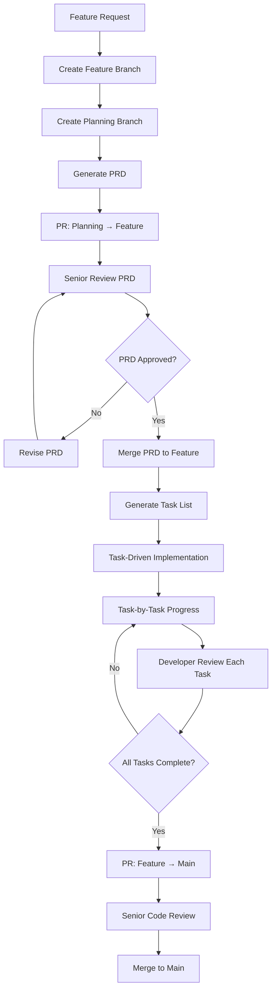
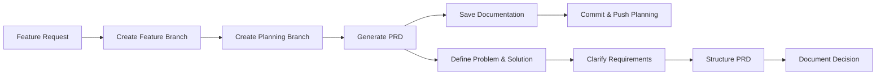
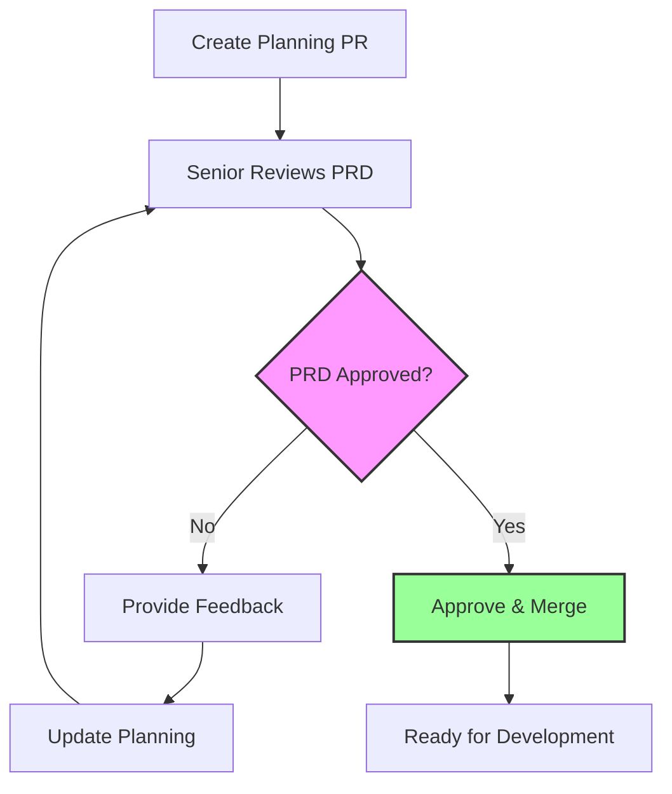
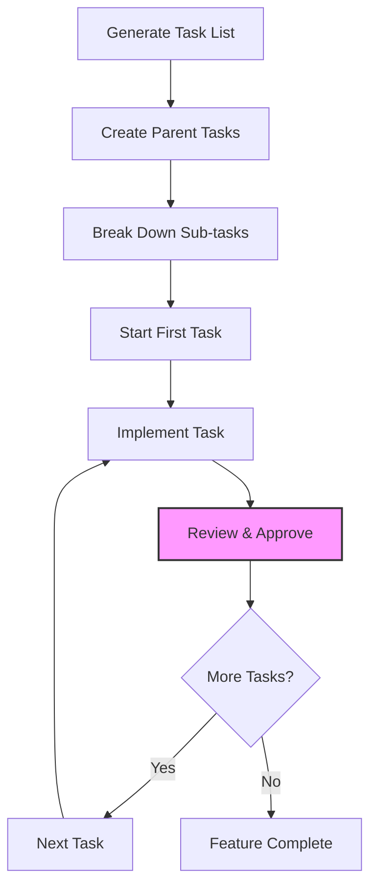
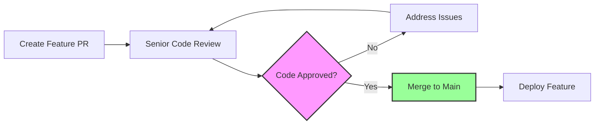

# 🚀 The Future of Coding: Task-Driven Development

## 📋 Resumen

Esta guía presenta un framework innovador de **Task-Driven Development** que transforma cómo los equipos desarrollan software de manera estructurada. Combina metodologías probadas de planificación con procesos de desarrollo controlados para crear un enfoque escalable, auditable y de alta calidad que maximiza la productividad mientras minimiza los riesgos.

**Objetivo**: Crear un desarrollo más eficiente y predecible, manteniendo calidad, control y transferencia de conocimiento en el equipo.

## 🎯 El Problema Actual: Más Allá del "Vibe Coding"

El auge de herramientas de AI ha popularizado el vibe coding - un enfoque donde los desarrolladores "fully give in to the vibes" y delegan completamente la escritura de código a LLMs sin revisión estructurada.

### **Los Riesgos del Vibe Coding Sin Estructura**

Como define **Simon Willison**: *"building software with an LLM without reviewing the code it writes"*, el vibe coding presenta riesgos significativos:

- **Pérdida de control**: *"I 'Accept All' always, I don't read the diffs anymore"* - Andrej Karpathy
- **Comprensión limitada**: *"The code grows beyond my usual comprehension"* 
- **Soluciones subóptimas**: *"Sometimes the LLMs can't fix a bug so I just work around it"*
- **Riesgo de producción**: No es production-ready sin revisión cuidadosa

### **Problemas Adicionales en Equipos**

- **Desarrollo no estructurado**: Features implementadas sin planificación clara
- **Falta de control**: Cambios grandes sin revisión adecuada 
- **Pérdida de contexto**: Decisiones de diseño no documentadas
- **Inconsistencia**: Cada developer usa enfoques diferentes
- **Scope creep**: Features que crecen sin límites definidos

## 💡 La Solución: Task-Driven Development

**Task-Driven Development** mantiene los beneficios del AI-assisted coding mientras elimina los riesgos del vibe coding descontrolado. En lugar de "Accept All" sin revisión, implementamos **control granular** con **aprobación por tarea**.

### **Vibe Coding vs Task-Driven Development**

| Aspecto | Vibe Coding | Task-Driven Development |
|---------|-------------|------------------------|
| **Control** | *"Accept All always"* | ✅ Aprobación por tarea individual |
| **Comprensión** | *"Code grows beyond comprehension"* | ✅ Tasks granulares y documentadas |
| **Planificación** | Improvisado | ✅ PRD estructura objetivos claros |
| **Revisión** | Sin revisar diffs | ✅ Múltiples puntos de control |
| **Debugging** | *"Random changes until it goes away"* | ✅ Contexto claro por task |
| **Producción** | *"Not production ready"* | ✅ Listo para producción |

### **Componentes Clave**

1. **Product Requirements Document (PRD)** como base de planificación
2. **Task Lists granulares** derivadas del PRD para guiar implementación
3. **Flujo de trabajo estructurado** con branches de planificación y desarrollo
4. **AI Assistants** como herramienta de implementación **controlada**
5. **Proceso de revisión** en múltiples niveles

## 🏗️ Arquitectura del Proceso

## 👥 Roles y Responsabilidades

### **Senior/Tech Lead** 
- Revisar y aprobar PRDs
- Validar arquitectura técnica
- Review final de código
- Mentoring en mejores prácticas

### **Developer/Feature Owner**
- Crear PRD inicial
- Generar task list
- Orquestar implementación
- Documentar decisiones

### **AI Assistant**
- Generar código basado en tareas
- Seguir patrones establecidos
- Implementar una tarea a la vez
- Esperar aprobación entre tareas

## 🔄 Proceso Detallado

### **Fase 1: Planificación**

**Elementos Clave del PRD:**
- **Problema y Solución**: Qué problema resuelve y cómo
- **Usuarios y Casos de Uso**: Quién lo usará y para qué
- **Requisitos Funcionales**: Qué debe hacer el sistema
- **Métricas de Éxito**: Cómo medir el éxito
- **Fuera de Scope**: Qué explícitamente no incluye

### **Fase 2: Revisión de Planificación**

**Proceso de Revisión:**
- Pull Request con PRD documentado
- Senior review enfocado en arquitectura y scope
- Iteración hasta aprobación
- Merge a feature branch para comenzar desarrollo

### **Fase 3: Implementación Task-Driven**

**Estructura de Tasks:**
- **Parent Tasks**: Componentes principales (5-7 tasks)
- **Sub-tasks**: Trabajo específico (30-60 min cada una)
- **Acceptance Criteria**: Definición clara de "done"
- **Files & Tests**: Archivos relevantes y estrategia de testing

### **Fase 4: Revisión Final**

## 🎯 Beneficios Esperados

### **Para el Negocio**
- ⚡ **Velocidad**: Aceleración significativa en el desarrollo
- 📊 **Predictibilidad**: Mejor estimación y seguimiento
- 🔍 **Trazabilidad**: Decisiones documentadas y auditables
- 💰 **ROI**: Mejor relación costo-beneficio en desarrollo

### **Para el Equipo**
- 🧠 **Aprendizaje**: Seniors mentorean, juniors aprenden
- 🎯 **Foco**: Desarrolladores se enfocan en lógica y arquitectura
- 📈 **Crecimiento**: Exposición a mejores prácticas
- 🤝 **Colaboración**: Proceso claro y compartido

### **Para la Calidad**
- ✅ **Testing**: Tests integrados en cada task
- 📝 **Documentación**: PRDs y tasks como documentación viva
- 🔒 **Consistencia**: Patrones uniformes
- 🛡️ **Revisión**: Múltiples puntos de control
- 🎯 **Scope Control**: Tasks granulares previenen scope creep

## 📊 Métricas de Éxito

### **Métricas de Velocidad**
- Throughput de features implementadas
- Tiempo promedio de task completion
- Eficiencia en procesos de review

### **Métricas de Calidad**
- Bugs en producción post-implementación
- Cobertura de tests automáticos
- Velocidad de resolución de incidencias

### **Métricas de Adopción**
- Porcentaje de features usando el proceso
- Satisfacción del equipo
- Eficiencia en onboarding de nuevos developers

## 🚀 Plan de Implementación

### **Fase 1: Preparación**
- [ ] Definir estructura de documentación
- [ ] Establecer templates y estándares
- [ ] Capacitar al equipo en metodología
- [ ] Crear ejemplos de referencia

### **Fase 2: Piloto**
- [ ] Seleccionar 1-2 features pequeñas
- [ ] Implementar con el proceso completo
- [ ] Recopilar feedback y ajustar
- [ ] Documentar lecciones aprendidas

### **Fase 3: Expansión**
- [ ] Aplicar a features medianas
- [ ] Refinar proceso basado en experiencia
- [ ] Entrenar a más miembros del equipo
- [ ] Establecer métricas de seguimiento

### **Fase 4: Adopción Completa**
- [ ] Implementar en todo el equipo
- [ ] Crear proceso de mejora continua
- [ ] Establecer centro de excelencia
- [ ] Compartir mejores prácticas

## ⚠️ Consideraciones y Riesgos

### **Riesgos de Proceso**
- **Overhead inicial**: Mitigar con templates y training
- **Resistencia al cambio**: Comunicar beneficios claramente
- **Rigidez excesiva**: Mantener flexibilidad en la implementación

### **Riesgos de Calidad**
- **Calidad variable**: Establecer checkpoints de revisión
- **Deuda técnica**: Reviews rigurosos y refactoring regular
- **Dependencia**: Balancear AI assistance con skill development

## 🎯 Principios Fundamentales

### **Transparencia sobre Velocidad**
- Cada decisión debe ser explicable
- Procesos auditables y documentados
- Control humano en decisiones críticas

### **Aprendizaje sobre Automatización**
- Developers aprenden mientras construyen
- Knowledge transfer embebido en tareas
- Capacidades humanas amplificadas, no reemplazadas

### **Calidad sobre Cantidad**
- Mejor menos features bien hechas
- Testing y documentación como ciudadanos de primera clase
- Sostenibilidad a largo plazo

---

*El futuro del desarrollo no es automatizar el pensamiento, sino estructurar la creatividad* 